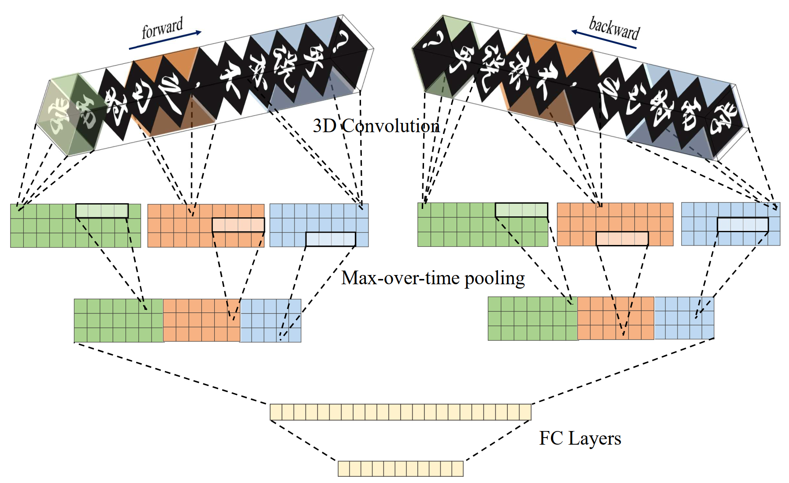

# 3D-convolutions for Chinese text classification
Learning distributed sentence vectors with bi-directional 3D convolutions

Liu, Bin, Liang Wang, and Guosheng Yin. "Learning distributed sentence vectors with bi-directional 3D convolutions." In Proceedings of the 28th International Conference on Computational Linguistics, pp. 6820-6830. 2020.
